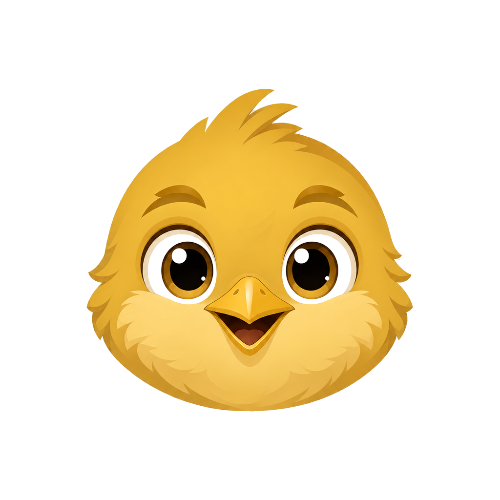

<h1 align="center">Wren</h1>

<p align="center">
  
</p>

<p align="center">
  A floating AI overlay for Windows.
</p>

<p align="center">
  <a href="LICENSE"></a>
  
  
  
  
  
</p>

---

Press a hotkey, ask a question, get an answer, dismiss. Wren is a desktop overlay that talks to a local Ollama instance. Nothing leaves your machine.

This is a Windows port of [`quiet-node/thuki`](https://github.com/quiet-node/thuki) by Logan Nguyen. The macOS pieces (NSPanel, Core Graphics event taps, the Accessibility / Screen Recording permission flow) are swapped for Windows equivalents: DWM border suppression, `tauri-plugin-global-shortcut`, the `screenshots` crate, Win32 desktop introspection. Wren also adds a tool-calling layer. A second local model can read your filesystem, list windows, and check the clipboard when the question calls for it.

Same license as upstream: Apache-2.0.

## What it does

- Global hotkey summons the overlay from any app, including fullscreen ones.
- Inference runs locally through Ollama. No API keys. No accounts. No telemetry.
- Two models: one for conversation, one (`qwen3:8b`) for tool calls. Wren picks between them based on what you asked.
- Capture your screen and send it as context with `/screen` or the screenshot button. (Highlighted-text capture is wired up on macOS through Accessibility APIs but not yet on Windows. It is on the roadmap.)
- Conversations persist in a local SQLite file. The last chat is still there when you reopen.
- Monochrome dark theme with a gold accent (`#d4af37`).

## Hotkeys

| Hotkey | What it does |
|--------|--------------|
| `Alt+Space` | Toggle the overlay. Chat persists across opens. |
| `Ctrl+Space` | Summon with a fresh chat. |

Both are global, registered via [`tauri-plugin-global-shortcut`](https://crates.io/crates/tauri-plugin-global-shortcut). They fire from any app.

## Slash commands

Type these at the start of your message:

| Command | Effect |
|---------|--------|
| `/think <question>` | Make the model reason through it before answering. |
| `/screen <question>` | Capture your full screen and attach it. |
| `/search <query>` | Live web search via the optional sandbox. |
| `/translate`, `/rewrite`, `/tldr`, `/refine`, `/bullets`, `/todos` | Prompt shortcuts on highlighted or quoted text. |
| `/tool <ask>` | Force-route to the tool model. |
| `/chat <ask>` | Force-route to the chat model. |

Without a slash, Wren picks the model based on simple heuristics: action verbs at the start, path-shaped strings, desktop keywords.

## Tools (Phase 1, read-only)

The tool model has access to:

- `read_file(path)` — UTF-8 text files
- `list_dir(path)` — directory entries
- `glob(pattern, root?)` — file search by pattern
- `grep_content(needle, pattern, root?)` — substring search inside files
- `active_window()` — title and process of the foreground window
- `list_windows()` — every visible top-level window
- `monitor_info()` — connected monitors with resolution and position
- `read_clipboard()` — current clipboard text

Read-only for now. Write, delete, and shell tools land in Phase 2 behind a per-call confirmation prompt.

## Getting started

### 1. Install Ollama, pull two models

[Install Ollama](https://ollama.com/download), then:

```bash
ollama pull gemma3:12b      # any chat model you like
ollama pull qwen3:8b        # the tool model
```

Pick the chat model from the in-app picker on first launch. The tool model is hard-coded to `qwen3:8b` for now.

If you use Ollama for other things, set these so Wren does not fight your other workloads:

```
OLLAMA_KEEP_ALIVE=5m
OLLAMA_MAX_LOADED_MODELS=1
```

### 2. Build and run

Tauri 2 + React 19 + Tailwind 4 on the frontend, Rust on the back.

```bash
git clone https://github.com/basezero-projects/wren.git
cd wren
pnpm install
pnpm tauri dev          # dev with HMR
pnpm tauri build        # production build
```

Requires:

- [Rust toolchain](https://rustup.rs/) (stable)
- [pnpm](https://pnpm.io/installation)
- [Tauri 2 prerequisites](https://v2.tauri.app/start/prerequisites/) for Windows. WebView2 is bundled with Win11; Visual Studio Build Tools are required for the Rust side.

### 3. Use it

Pick your chat model from the picker chip on first launch. Then `Alt+Space` summons Wren from anywhere. Type, press Enter. `Alt+Space` again to dismiss; the chat sticks around. `Ctrl+Space` summons with a clean slate.

## Architecture

- `src/` — React 19, TypeScript, Tailwind 4, Framer Motion. UI morphs between a compact ask bar and an expanded chat. Streaming uses Tauri's Channel API.
- `src-tauri/src/` — app bootstrap, Ollama HTTP streaming, Win32 DWM polish (kills the default Win11 border and corner clip on transparent overlays), global hotkey, screen capture (downscaled to 1280px so vision models do not drown in tokens), tool-call loop.
- `src-tauri/src/tools.rs` — JSON-Schema definitions sent to Ollama, plus a single `dispatch(name, args)` entrypoint that runs each tool in-process.
- `src-tauri/src/commands.rs::route_message` — rule-based routing. Slash overrides win.
- SQLite via `rusqlite`, stored in the Tauri app data directory.

See [`docs/configurations.md`](docs/configurations.md) for the user-tunable config schema.

## Status

Early. Expect rough edges. Chat is stable. Tool calling is in active development. Phase 1 (read-only) is what is shipping; Phase 2 (write, delete, shell with confirmations) is next.

## Acknowledgements

Wren is a fork of [`quiet-node/thuki`](https://github.com/quiet-node/thuki) by Logan Nguyen. He wrote the macOS implementation, the streaming Ollama transport, the config system, and the agentic search sandbox; most of the UX shape is also his. What I added on top: a Windows port, a reskin, and the tool-calling layer.

License is Apache-2.0, same as upstream.
